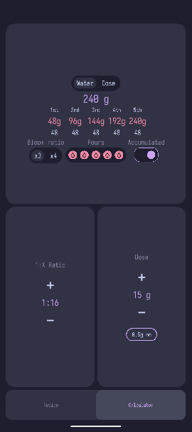

# Brew Timer

This is a Pour Over coffee ratio calculator (hopefully in the future with Presets and
Timer for guided brews)

It uses [raylib](https://github.com/raysan5/raylib) for rendering +
[clay](https://github.com/nicbarker/clay) for calculating the ui and
[odin](https://odin-lang.org/) because i wanted to try it

It compiles to linux and android

The UI ist very bad and not ready

## Disclamer 

I wouldn't use this if I was you. Its highly experimental

## Building

If you still want to build it

1. You need the android SDK and NDK (just download Android Studio for the SDK
   Manager)
2. Clone the repo recursivly
3. Adjust the paths in the Makefile for the Android SDK and NDK
4. then hopefully just run make apk and you will get a unsigned (debug keystore)
   test.apk that you can run on your phone (maybe) or in the emulator
   
# Why

Because its possible

## Why not Jetpack Compose

Android Studio sucks my laptop cant handle it. I dont like the idea of creating
a projekt and get spammed with hundred files where I dont what there do or why I
need them.

# AI Usage

I used Claude to figure out how to link with the NDK and for the native entry
point
